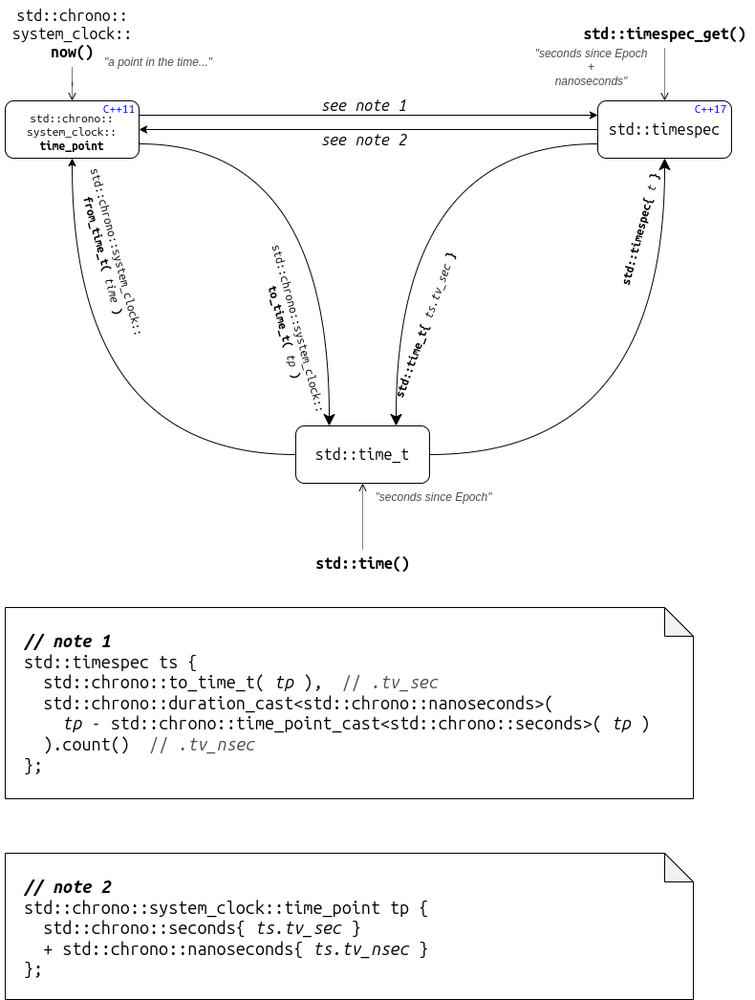

# C++ Standard Library Time function reminder

Sometimes I need to manage time point in `std::timespec` representation rather than in `std::chrono::system_clock::time_point` which I prefer.

These are just some annotations and code code snippets that help me to remember how to make timestamps conversions and how to print them.

Here is a (quite ugly) diagram made with [draw.io](https://www.drawio.com/)



Be sure that the `std::timespec` object is a time point and not a duration.

Sometime I prefer a function more like `std::chrono::system_clock::now()` to obtain the actual time point in a `std::timespec` object in just one line. Like this

```c++
std::timespec timespec_now() {
  std::timespec ts;
  std::timespec_get(&ts, TIME_UTC);
  return ts;
}
```

## Conversion functions

`std::chrono::system_clock::time_point` to `std::timespec`

```c++
std::timespec 
timepoint2timespec(std::chrono::system_clock::time_point const& tp) {
  return std::timespec {
    std::chrono::system_clock::to_time_t( tp ),
    std::chrono::nanoseconds{
      tp - std::chrono::time_point_cast<std::chrono::seconds>(tp)
    }.count()
  };
}
```

And `std::timespec` to `std::chrono::system_clock::time_point`

```c++
std::chrono::system_clock::time_point
timespec2timepoint(std::timespec const& ts) {
  return std::chrono::system_clock::time_point {
    std::chrono::seconds{ ts.tv_sec } +
    std::chrono::nanoseconds{ ts.tv_nsec }
  };
}
```

## Test program

```c++
#include <iostream>
#include <chrono>

int main()
{
  auto tp = std::chrono::system_clock::now(); // get time_point
  auto ts = timepoint2timespec(tp); // check conversion tp -> ts

  // Check if std::operator<<() to_string(tp) and to_string(ts) are equal
  std::cout << tp << std::endl;
  std::cout << to_string( tp ) << std::endl;
  std::cout << to_string( ts ) << std::endl;

  // Check conversion ts -> tp
  tp = timespec2timepoint(ts);
  std::cout << to_string(tp) << std::endl;

  // Output must be the same for every print
}
```

Run it on [godbolt.org](https://godbolt.org/z/75KK3316o) !

## Printing timestamps

Starting from gcc 13.1, and thanks to C++20, you can print a `std::chrono::system_clock::time_point` to stdout easily via [`operator<<(std::ostream&, ...)`](https://en.cppreference.com/w/cpp/chrono/system_clock/operator_ltlt) in the format *`yyyy-mm-dd hh:mm:ss.nanoseconds`*. Just remember the flag `-std=c++20`.

```c++
std::cout << std::chrono::system_clock::now();

// stdout: 2024-10-05 18:25:15.482510327
```

If you don't have yet gcc 13.1, you need first to convert a `std::chrono::time_point` into a `std::tm` (via a `std::time_t` conversion), then use [`std::strftime()`](https://en.cppreference.com/w/cpp/chrono/c/strftime) to obtain the string. Maybe like this:

```c++
// Print a std::chrono::system_clock::time_point
std::string to_string(std::chrono::system_clock::time_point const& tp)
{
  std::time_t t { std::chrono::system_clock::to_time_t( tp ) };
  std::tm* tmPtr = std::gmtime( &t );

  char tmp[30]{}; // size for storing "yyyy-mm-dd hh:mm:ss.nnnnnnnnn\0"
  const char format[] = "%F %T.";
  std::strftime(tmp, std::size(tmp), format, tmPtr);

  std::chrono::nanoseconds ns {
    tp - std::chrono::time_point_cast<std::chrono::seconds>(tp)
  };

  return std::string(tmp) + std::to_string( ns.count() );
}
```

Almost the same for `std::timespec`

```c++
// Print a std::timespec
std::string to_string(std::timespec const& ts) {
  const std::time_t t { ts.tv_sec };
  const std::tm* tmPtr = std::gmtime( &t );

  char tmp[30]{}; // size for storing "yyyy-mm-dd hh:mm:ss.nnnnnnnnn\0"
  const char format[] = "%F %T.";
  std::strftime(tmp, std::size(tmp), format, tmPtr);

  return std::string(tmp) + std::to_string(ts.tv_nsec);
}
```

## Other issues

**Mutithreading**: [`std::gmtime()`](https://en.cppreference.com/w/cpp/chrono/c/gmtime) is shamefully not thread-safe. If you need these functions in a multi-threading program, you can use the safest [`gmtime_r()`](https://en.cppreference.com/w/c/chrono/gmtime) from C Standard Library (defined in header `<time.h>`).

**Timezones**: `gmtime()` returns the a calendar time expressed in UTC from a time sice epoch. If you need a local time, use [`localtime()`](https://en.cppreference.com/w/cpp/chrono/c/localtime).

**Misuring time**: remember that if you don't need a time point related to a calendar time (for example, you want a stopwatch), simply use `std::chrono::steady_clock`.

## Useful meterials about time in C++

[Clocks, Points in Time, and Time Durations](https://www.open-std.org/jtc1/sc22/wg21/docs/papers/2008/n2661.htm#time_point) from open-std.org documentation.

[Time Types](https://www.gnu.org/software/libc/manual/html_node/Time-Types.html) from gnu.org documentation.

[CppCon 2016: Howard Hinnant “A ＜chrono＞ Tutorial"](https://youtu.be/P32hvk8b13M?si=1Ecsr-wHTE5n1OOX) youtube video.
